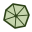

# qTracer — CloudCompare Plugin

A **CloudCompare** Standard plugin for extracting **Discrete Fracture Network
(DFN)** traces, joint planes, and fracture-intensity statistics from
rock-outcrop point clouds.

---

## Features

The plugin adds five actions under CloudCompare's **Plugins** menu. All
user-facing names follow the terminology of the accompanying paper (§2).

| Icon | Action | Purpose |
|:---:|---|---|
|  | **Color Filtering…** | Interactive weighted-sum colour pre-filter with live 3D preview; produces a filtered sibling cloud that can feed the extraction pipeline. |
|  | **Outcrop Area Computation…** | Estimate the outcrop sampling area (the P21 denominator) by one of three partitioners. |
|  | **P21 Computation…** | Areal fracture intensity P21 = total trace length / outcrop area, from DB-tree candidates. |
|  | **Filter Traces by Length…** | Interactively remove short / over-long traces from a traces group, with a draggable length histogram and live 3D preview. |
|  | **Fracture Extraction (Pipeline)** | The main 6-stage DFN-extraction pipeline (checkable stages, contiguous subset allowed). |

### Color Filtering

Designed for field photogrammetry clouds where rock surfaces differ in tone
from vegetation, shadows, etc. The filter is a single colour index:

```
C = a·R + b·G + c·B          a, b, c ∈ [0, 1]
keep point iff  C_min ≤ C ≤ C_max
```

The dialog shows a histogram of `C` with two draggable cursor lines
(green = min, red = max), paired with spinboxes for exact numeric input.
To filter on a single channel, zero the other two coefficients. Preview is
non-destructive (driven by the cloud's visibility array; Cancel restores it);
on OK a new sibling cloud `<name> [color filtered C(a,b,c) min-max]` is created
via `partialClone`, and the selection moves to it — ready for the pipeline.

### Outcrop Area Computation

Estimates the outcrop surface area used as the P21 denominator. Three
partitioners, selected from a combobox:

- **Octree** — uniform cubic cells; per-cell PCA + a `(λ2-λ3)/λ1` planarity
  filter; area = Σ of the polygon where each cell's best-fit plane meets the
  cell box.
- **Kd-tree** — adaptive binary splits until each leaf's planar-fit RMS falls
  below `Max error`; the plane equation is stored on each leaf (no extra PCA);
  the "cell" is the leaf points' AABB.
- **Projected** *(recommended for a quasi-planar outcrop)* — fits one global
  best-fit plane, projects all points to it, and measures the footprint by
  **2D grid occupancy** (area = occupied cells × cell²). Also reports a
  convex-hull area, best-fit dip/dip-direction, off-plane RMS (roughness), and
  in-plane extent. Unlike Octree/Kd-tree — which sum a resolution-dependent 3D
  rugose area — the projected footprint is convergent and planar, matching the
  standard P21 sampling-window definition.

Optionally emits a triangulated *Area patches* mesh (per-cell plane-box polygons
for Octree/Kd-tree, or one quad per occupied grid cell for Projected) so the
counted surface can be verified visually.

### P21 Computation

Walks the DB tree to collect candidates automatically:

- **Trace sources**: any node whose top-level children carry a 2-vertex
  polyline descendant (matches both stage-3 `[trace pieces]` and stage-4
  `Traces` groups, as well as length-filtered groups; contour polylines are
  excluded by the 2-vertex check).
- **Area sources**: any mesh in the DB (area from `MeshSamplingTools`), with an
  optional manual value override.

The dialog pre-selects candidates matching the current DB selection, lets the
user pick the convention (per-cluster vs combined), and shows
**P21 = L / A** in place.

### Filter Traces by Length

Post-processing for a traces group (`Traces` or `[trace pieces]`). Each direct
child carrying a 2-vertex polyline is one trace; a length histogram with
draggable min/max cursors previews the survivors live (traces outside the range
are hidden via `setEnabled`; non-destructive — both accept and cancel restore
the original state). On OK a **new** sibling group `<name> [len min-max]` of
freshly-rebuilt bare 2-vertex polylines is created, the source is hidden, and
the new group is selected. This group works directly as input to both **P21**
and stage-5 **Plane Fitting**.

### Fracture Extraction (Pipeline)

Runs all or part of 6 stages sequentially. Each stage is a checkable group in
the parameter dialog — the user can enable any **contiguous** range (e.g. `1–6`,
`2–4`, `6` alone); gaps are rejected. Every parameter and stage selection
persists across runs via `QSettings`.

1. **Eigenvector Computing** — when started at stage 1, first **clones** the
   selected cloud (`<name> [eigen features]`) and runs stage 1 and all later
   stages on the clone, so the original is never modified. Per-point PCA adds
   `PC Linearity` and `MaxEigVec_X/Y/Z` scalar fields. Two modes: a fixed
   `Kernel radius`, or an optional per-point **auto-scale** that picks each
   point's radius from a range by minimising eigenentropy (default) or
   maximising linearity.
2. **Cylindrical DBSCAN Clustering** — a directional DBSCAN variant. Neighbour
   search is cylindrical (along each point's `MaxEigVec`, `h = 2ε`) or
   spherical; a neighbour joins only if its `MaxEigVec` aligns with the seed's
   within an angular tolerance and its linearity exceeds `L`. Writes a `DBSCAN`
   scalar field.
3. **Lineation** — extracts connected components on the `DBSCAN` SF, wraps each
   in a `ccFacet` and builds a 2-vertex *trace polyline* whose endpoints are the
   extreme projections of the cluster points along their principal axis. Output
   `<cloud> [trace pieces]` / `Trace piece N`. Each piece's cloud keeps its
   `DBSCAN` cluster id.
4. **Trace Clustering** — region-growing merge of close, collinear trace pieces
   into merged traces. A `Number of passes` parameter re-runs the merge on the
   previous pass's output (stops early when the trace count no longer
   decreases). Output `Traces` / `Merged trace N`.
5. **Plane Fitting** — pairs near-intersecting merged traces (by threshold
   distance, angle, and length) and fits a joint-plane `ccFacet` on the pooled
   endpoints. Output `Joint Planes`.
6. **Coplanar Plane Merging** — iterative sequential-RANSAC consolidation of
   near-coplanar joint planes. A peer joins a seed when its normal is within
   `α_max`, its centroid is within `δ_max` of the seed plane, and (optionally)
   within `Max centroid distance` of the seed's centroid. Iterates up to
   `Max passes`, stopping when the plane count no longer decreases. An optional
   *Drop unmerged planes* removes facets that never merged. Output
   `Merged Joint Planes`.

Starting at stage ≥ 2 requires the selected cloud to already carry the upstream
scalar fields; starting at stage ≥ 4 expects the selection to be the
corresponding group produced by the preceding stage.

All stage outputs are added under one parent DB node `qTracer [<cloud name>]`.

---

## Installation

The plugin must be ABI-compatible with your CloudCompare build, so the
recommended path is to **build it from source against the same CloudCompare
version you are running**. Pre-built binaries may be attached to the repo's
[Releases] page; they only work when built against the exact CloudCompare
version you use.

[Releases]: ../../releases

### Build from source

Requires the CloudCompare source tree, a C++17 toolchain, and Qt 6.

1. Clone CloudCompare and check out the pinned version this plugin is known to
   build against — **`v2.13.1-344-g5cba96f4`** (commit `5cba96f4`):
   ```bash
   git clone https://github.com/CloudCompare/CloudCompare.git
   cd CloudCompare && git checkout 5cba96f4 && git submodule update --init --recursive
   ```
   (Newer commits may also work, but the plugin API is only guaranteed here.)
2. Clone this plugin into CloudCompare's Standard-plugin folder, as a directory
   named `qTracer`:
   ```bash
   git clone https://github.com/jatestrella/CCplugin-qTracer.git \
       <CloudCompare>/plugins/core/Standard/qTracer
   ```
   (The folder must be named `qTracer` — the repo name differs, so give the
   target path explicitly as above.)
3. Configure with the plugin option enabled:
   ```bash
   cmake -S <CloudCompare> -B <build> -DPLUGIN_STANDARD_QTRACER=ON
   ```
   (plus whatever toolchain settings your CloudCompare build uses — vcpkg, Qt, …)
4. Build and install:
   ```bash
   cmake --build   <build> --config Release --target qTracer
   cmake --install <build> --config Release --prefix <install>
   ```
5. Run CloudCompare from `<install>`. The five qTracer actions appear under the
   **Plugins** menu.

Dependencies: **Qt 6** (`Core`, `Gui`, `Widgets`, `Svg`, `PrintSupport`) and
**QCustomPlot** (vendored by CloudCompare at `qCC/extern/QCustomPlot`, linked
automatically). No external geometry libraries required.

### Installing a pre-built binary (if available)

1. Download the plugin binary (`qTracer.dll` / `.so` / `.dylib`).
2. Copy it into CloudCompare's **plugins** folder:
   - **Windows**: `C:\Program Files\CloudCompare\plugins\`
   - **Linux**: `<install prefix>/lib/cloudcompare/plugins/`
   - **macOS**: *CloudCompare.app* → *Show Package Contents* →
     `Contents/Plugins/ccPlugins/`
3. Restart CloudCompare. If you see "plugin failed to load", the binary and your
   CloudCompare version are ABI-incompatible — rebuild from source.

---

## Typical workflow

1. **Load** a coloured outcrop point cloud.
2. *(optional)* **Color Filtering** — remove vegetation / shadow returns; the
   filtered cloud is auto-selected.
3. **Fracture Extraction (Pipeline)** — tune *Kernel radius* and *DBSCAN radius
   (ε)* to the cloud's point spacing (a reasonable start is 2–3× that spacing).
   Output appears under `qTracer [<cloud name>]`.
4. *(optional)* **Filter Traces by Length** on the `Traces` group to drop noise
   traces before area/P21 or plane fitting.
5. **Outcrop Area Computation** on the source cloud — use **Projected** for a
   quasi-planar outcrop (the convergent P21 denominator); Octree/Kd-tree for
   rugose surfaces.
6. **P21 Computation** — the dialog auto-populates both dropdowns; press
   Compute. Results (total length, area, P21) show in the dialog and console.

---

## Known limitations

- **Performance.** DBSCAN is single-threaded and scales with point count.
  Expect minutes on 10M+ point clouds. Each stage drives a progress bar.
- **Cancel button** on stage progress dialogs is present but not yet wired —
  stages don't honour cancellation.
- **Unsupported plane fits.** Stage-5 plane fitting occasionally produces
  near-horizontal facets that lack point-cloud support (degenerate fits from the
  trace endpoints alone). Integrating plane fitting with RANSAC / facet
  point-support is planned to remove these.
- **Trace polyline length** uses principal-axis projection of the cluster
  points, so values are internally consistent but may differ numerically from a
  bounding-box-diagonal estimate used by some other tools.

---

## Authors

**Chia-Chi (Jate) Chiu** — plugin author and maintainer.
Rock Lab, Institute of Mineral Resources Engineering,
National Taipei University of Technology.
Contact: <ccchiu@ntut.edu.tw>

The extraction pipeline is based on an earlier DFN research prototype by the
author; stages 1–5 are a faithful port with several geometric and numerical
fixes, and stage 6 (coplanar-plane merging) plus the auxiliary actions
(*Color Filtering*, *Outcrop Area Computation*, *P21 Computation*, *Filter
Traces by Length*) are new contributions.

Third-party components: [QCustomPlot](https://www.qcustomplot.com/) for the
histogram widgets (vendored inside CloudCompare), and a colour-generation
helper adapted from CloudCompare's **qFacets** plugin (© Thomas Dewez, BRGM).

---

## License

GNU GPL v2 or later — matching CloudCompare's licensing.
