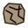

# qTracer — CloudCompare Plugin

A **CloudCompare** Standard plugin for extracting **Discrete Fracture Network
(DFN)** traces, joint planes, and fracture-intensity statistics
from rock-outcrop point clouds.

---

## Features

The plugin adds four actions under CloudCompare's **Plugins** menu:

| Icon | Action | Purpose |
|:---:|---|---|
|  | **Filter by Color…** | Interactive R/G/B + weighted-sum pre-filter with live 3D preview; produces a filtered sibling cloud that can feed into the extraction pipeline. |
|  | **Extract Fractures (Pipeline)** | The main 6-stage DFN-extraction pipeline (checkable stages, contiguous subset allowed). |
|  | **Compute Outcrop Area…** | Estimate the outcrop surface area by summing local-plane / cell-box intersection polygons over an octree or kd-tree partition. |
|  | **Compute P21…** | Fracture intensity P21 = total trace length / outcrop area, picked from DB-tree candidates. |

### 1. Filter by Color

Designed for field photogrammetry clouds where rock surfaces differ in tone
from vegetation, shadows, etc. The filter is:

```
C = a·R + b·G + c·B          a, b, c ∈ [0, 1]
keep point iff  C_min ≤ C ≤ C_max
```

The dialog shows a histogram of `C` with two draggable cursor lines
(green = min, red = max), paired with spinboxes for exact numeric input.
Changing any coefficient rescales the histogram's x-range to `(a+b+c)·255`
so the threshold picker always spans the reachable range. On accept the
source cloud is hidden and the new filtered cloud becomes the selection,
ready for the extraction pipeline.

### 2. Extract Fractures (Pipeline)

Runs all or part of 6 stages sequentially. Each stage is a checkable
group in the parameter dialog — the user can enable any **contiguous**
range (e.g. `1–6`, `2–4`, `6` alone); gaps are rejected. All parameters
and stage selections persist across runs via `QSettings`.

1. **Compute Eigen Features** — per-point PCA: adds `PC Linearity` and
   `MaxEigVec_X/Y/Z` scalar fields to the cloud.
2. **DBSCAN** — a directional DBSCAN variant. Neighbour search is either
   cylindrical (along each point's `MaxEigVec`) or spherical; neighbours
   join a cluster only if their `MaxEigVec` aligns with the seed's within
   an angular tolerance. Writes a `DBSCAN` SF.
3. **Create Traces** — extracts connected components on the `DBSCAN` SF,
   wraps each in a `ccFacet` and builds a 2-vertex *trace polyline* whose
   endpoints are the extreme projections of the cluster points along the
   cluster's principal axis.
4. **Trace Clustering** — region-growing merge of close, collinear
   traces into *combined traces*.
5. **Plane Fitting** — pairs near-intersecting combined traces into
   joint-plane `ccFacet`s.
6. **Merge Coplanar Planes** — iterative sequential-RANSAC
   consolidation of near-coplanar joint planes. Each pass re-fits the
   largest consensus group; iteration stops when the plane count stops
   decreasing or `Max passes` is reached.

Starting at stage ≥ 2 requires the selected cloud to already carry the
upstream scalar fields; starting at stage ≥ 4 expects the selection to
be the corresponding group object produced by the preceding stage.

### 3. Compute Outcrop Area

Partitions the cloud and, for every cell that passes the quality
filter, computes the polygon where the local best-fit plane intersects
the cell's axis-aligned box. The areas are summed to give the outcrop
surface area. Two partitioners:

- **Octree** — uniform cubic cells at the level whose size is closest
  to the user's requested value. Per-cell PCA + a `(λ2-λ3)/λ1` planarity
  filter.
- **Kd-tree** — recursive binary splits until each leaf's planar-fit
  RMS falls below the user's `Max error`. The plane equation is stored
  on each leaf, so no extra PCA and no separate planarity filter are
  needed; the "cell" is the leaf points' AABB.

Optionally emits a triangulated *Area patches* mesh showing every
counted polygon — useful for visually verifying what was included.

### 4. Compute P21

Walks the DB tree to collect candidates automatically:

- **Trace sources**: any node whose top-level children carry a 2-vertex
  polyline descendant (matches both stage-3 `[facets]` and stage-4
  `Traces` groups; contour polylines are excluded by the 2-vertex
  check).
- **Area sources**: any mesh in the DB (total area computed from
  triangle sum), with an optional manual value override.

The dialog pre-selects candidates matching the current DB selection and
shows the result (trace length, area, and **P21 = L / A**) in place.

---

## Installation

The plugin must be ABI-compatible with your CloudCompare build, so the
recommended path is to **build it from source against the same
CloudCompare source/version you are running**. Pre-built binaries may
be attached to the repo's [Releases] page from time to time; if so you
can skip the build and copy them into CloudCompare's `plugins/` folder
directly, but that only works when the binary was built against the
exact CloudCompare version you use.

[Releases]: ../../releases

### Build from source

Requires the CloudCompare source tree, a C++17 toolchain, and Qt 6.

1. Clone the CloudCompare source:
   ```bash
   git clone https://github.com/CloudCompare/CloudCompare.git
   ```
2. Place this plugin directory at
   `<CloudCompare>/plugins/core/Standard/qTracer` (either clone it
   there directly, or symlink / copy it into the CloudCompare tree).
3. Configure the build with the plugin option enabled:
   ```bash
   cmake -S <CloudCompare> -B <build> \
         -DPLUGIN_STANDARD_QTRACER=ON
   ```
   You may also need the toolchain settings your CloudCompare build
   normally uses (vcpkg, Qt, etc.).
4. Build and install:
   ```bash
   cmake --build   <build> --config Release --target qTracer
   cmake --install <build> --config Release --prefix <install>
   ```
5. Run the CloudCompare executable from `<install>`. The four
   qTracer actions will appear under the **Plugins** menu.

Dependencies: **Qt 6** (`Core`, `Gui`, `Widgets`, `Svg`, `PrintSupport`)
and **QCustomPlot** (vendored by CloudCompare at
`qCC/extern/QCustomPlot`, linked automatically). No external geometry
libraries required.

### Installing a pre-built binary (if available)

If a build for your platform is attached to a GitHub release:

1. Download the plugin binary (`qTracer.dll` on Windows,
   `qTracer.so` on Linux, `qTracer.dylib` on macOS).
2. Locate CloudCompare's **plugins** folder:
   - **Windows**: `<CloudCompare install>\plugins\`
     (typically `C:\Program Files\CloudCompare\plugins\`)
   - **Linux**: `<install prefix>/lib/cloudcompare/plugins/`
   - **macOS**: inside the `.app` bundle — right-click
     *CloudCompare.app* → *Show Package Contents* →
     `Contents/Plugins/ccPlugins/`
3. Copy the binary into that folder and restart CloudCompare.
4. If you see "plugin failed to load", the binary and your
   CloudCompare version are ABI-incompatible — rebuild from source.

---

## Typical workflow

1. **Load** a coloured outcrop point cloud.
2. *(optional)* **Filter by Color** — remove vegetation / shadow
   returns. The filtered cloud is auto-selected.
3. **Extract Fractures (Pipeline)** — tune *Kernel radius* and
   *DBSCAN radius* to the cloud's average point spacing (a reasonable
   starting point is 2–3× that spacing). Output appears under
   `qTracer [<cloud name>]` in the DB tree.
4. **Compute Outcrop Area** on the same source cloud. Pick Octree for
   uniformly-sampled clouds, Kd-tree for uneven density. Enable
   *"Add per-cell patch mesh"* to visually verify coverage.
5. **Compute P21** — the dialog should auto-populate both dropdowns;
   press Compute. Results (total length, area, P21) are shown in the
   dialog and mirrored to the console.

---

## Known limitations

- **Performance.** DBSCAN is single-threaded and scales linearly with
  point count. Expect minutes on 10M+ point clouds. Each stage drives a
  progress bar.
- **Stage 3 consumes the DBSCAN SF** during connected-component
  extraction (to keep it from being copied into every sub-cloud). To
  re-run stage 3 you need to re-run stage 2 first.
- **Cancel button** on stage progress dialogs is present but currently
  not wired — stages don't honour cancellation. Pipeline can only be
  aborted by closing the window or killing CloudCompare.
- **Trace polyline length** uses principal-axis projection of the
  cluster points, which differs from a simple bounding-box-diagonal
  estimate used in some earlier implementations of the same concept —
  values are therefore comparable within qTracer but may differ
  numerically from other tools.

---

## Authors

**Jate Chia-Chi Chiu** — plugin author and maintainer.
Rock Lab, Institute of Mineral Resources Engineering,
National Taipei University of Technology.
Contact: <ccchiu@ntut.edu.tw>

The extraction pipeline is based on an earlier DFN research prototype
by the author; stages 1–5 are a faithful port with a few geometric and
numerical fixes, and stage 6 (coplanar-plane merging) plus the three
auxiliary actions (*Filter by Color*, *Compute Outcrop Area*, *Compute
P21*) are new contributions.

Third-party component: [QCustomPlot](https://www.qcustomplot.com/) for
the color-filter histogram widget, vendored inside CloudCompare.

---

## License

GNU GPL v2 or later — matching CloudCompare's licensing.
